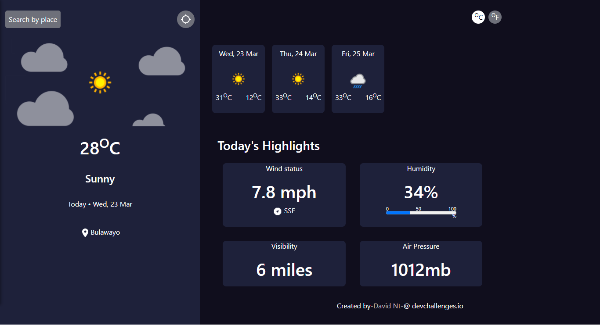

<!-- Please update value in the {}  -->

<h1 align="center">Weather Condition App using weatherapi</h1>


<div align="center">
  <h3>
    <a href="https://dn-weather.netlify.app/">
      Demo
    </a>
    <span> | </span>
    <a href="https://github.com/DavNt/weatherreport-app">
      Solution
    </a>
    <span> | </span>
    <a href="https://devchallenges.io/challenges/mM1UIenRhK808W8qmLWv">
      Challenge
    </a>
  </h3>
</div>

<!-- TABLE OF CONTENTS -->

## Table of Contents

- [Overview](#overview)
  - [Built With](#built-with)
- [Features](#features)
- [How to use](#how-to-use)
- [Contact](#contact)
- [Acknowledgements](#acknowledgements)

<!-- OVERVIEW -->

## Overview



Introduce to project

- Where can I see your demo?

  <a href="https://dn-weather.netlify.app/">
    Demo
  </a>


- What was your experience?
  
  Using React, React Hooks, Axios and Bootstrap components 

- Your wisdom? :)

  Experience is gained through doing something.


### Built With

<!-- This section should list any major frameworks that you built your project using. Here are a few examples.-->

- [React](https://reactjs.org/)

## Features

<!-- List the features of your application -->

-User story: I can see city weather as default, preferably my current location
-User story: I can search for city
-User story: I can see weather of today and the next 5 days
-User story: I can see the date and location of the weather
-User story: I can see according to image for each type of weather
-User story: I can see the min and max degree each day
-User story: I can see wind status and wind direction
-User story: I can see humidity percentage
-User story: I can see a visibility indicator
-User story: I can see the air pressure number
-User story: I can request my current location weather
-User story: I can convert temperature in Celcius to Fahrenheit and vice versa

## How To Use

<!-- Example: -->

To clone and run this application, you'll need [Git](https://git-scm.com) and [Node.js](https://nodejs.org/en/download/) (which comes with [npm](http://npmjs.com)) installed on your computer. From your command line:

```bash
# Clone this repository
$ git clone https://github.com/DavNt/weatherreport-app

# Install dependencies
$ npm install

# Run the app
$ npm start
```

## Acknowledgements

<!-- This section should list any articles or add-ons/plugins that helps you to complete the project. This is optional but it will help you in the future. For example: -->

- [Steps to replicate a design with only HTML and CSS](https://devchallenges-blogs.web.app/how-to-replicate-design/)
- [Node.js](https://nodejs.org/)
- [Marked - a markdown parser](https://github.com/chjj/marked)

## Contact

- GitHub [@DavNt](https://github.com/DavNt)
- Twitter [@DavNtM](https://twitter.com/DavNtM)
